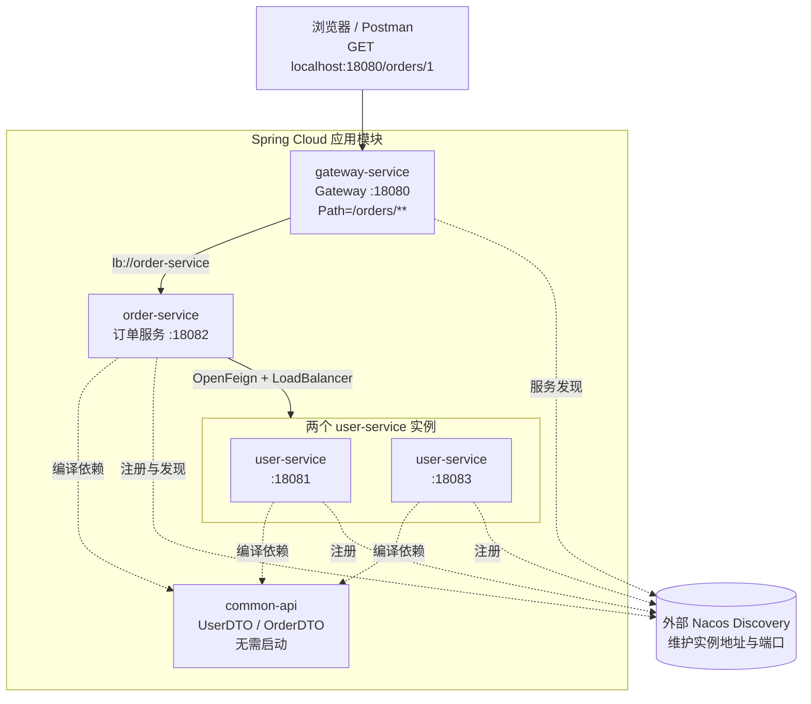
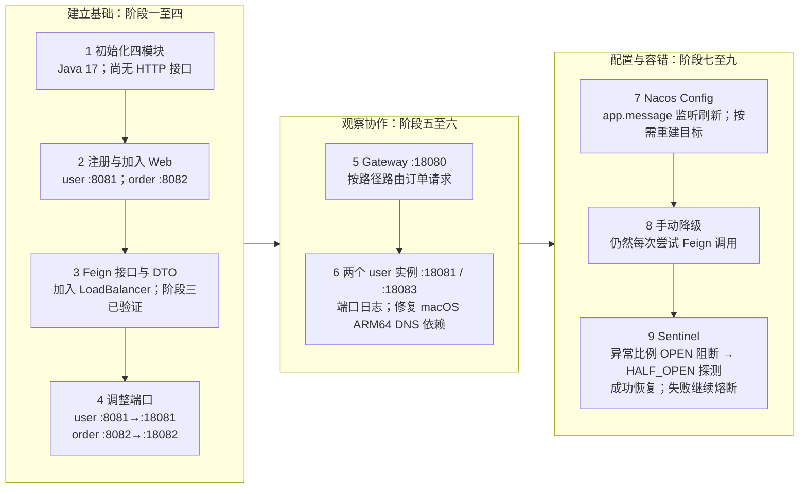
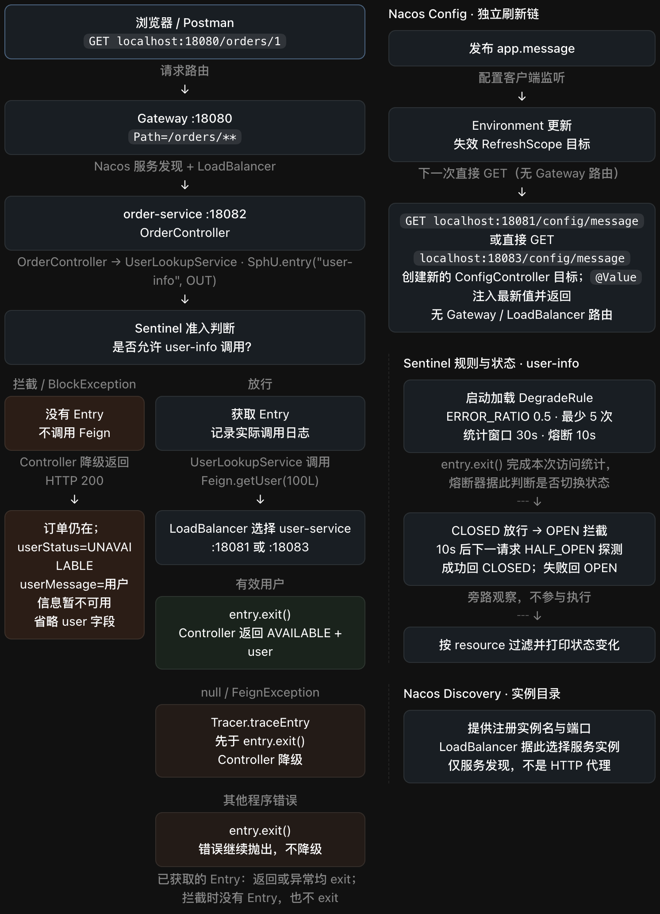

# Spring Cloud 学习记录

本仓库按提交逐步演进。下面九份文档记录各阶段的历史快照和当时的验证方式；当前项目还包含这些提交之后的功能与配置。请以当前源码及配置为准启动完整项目，历史命令仅用于理解对应阶段，不能直接当作当前完整功能的操作说明。

## 基础架构与模块（第六阶段累计结构）

图中呈现阶段六累计形成的结构；前六阶段是逐步演进过程，阶段一至四并非都有 HTTP 接口。Spring Boot 启动每个应用，Spring Cloud 协调应用间调用。图中实线表示业务请求，虚线表示注册、发现或编译依赖。阶段三已验证 OpenFeign 配合 LoadBalancer 调用服务；阶段六展示两个 user-service 实例的负载均衡。

## 九阶段学习演进

这两张图从架构和学习演进两个层次概览项目；它们不是按原始提交逐张还原的截图。

## 完整运行逻辑

展开查看 SCDemo 可视化

## 九阶段历史快照

1. [阶段一：初始化多模块项目](docs/learning/01-initialization/README.md)
2. [阶段二：接入 Nacos 服务注册](docs/learning/02-nacos-registration/README.md)
3. [阶段三：实现 OpenFeign 远程调用](docs/learning/03-openfeign/README.md)
4. [阶段四：调整服务默认端口](docs/learning/04-service-ports/README.md)
5. [阶段五：接入 Gateway 订单路由](docs/learning/05-gateway/README.md)
6. [阶段六：增加用户实例日志并修复网关 DNS 依赖](docs/learning/06-load-balancing/README.md)
7. [阶段七：接入 Nacos Config 动态配置](docs/learning/07-nacos-config/README.md)
8. [阶段八：订单服务手动降级](docs/learning/08-order-degradation/README.md)
9. [阶段九：接入 Sentinel 熔断](docs/learning/09-sentinel/README.md)
